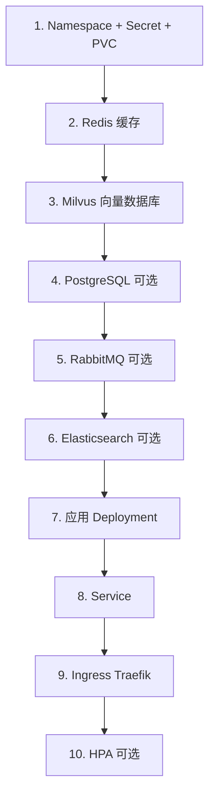

# langchain4j-agent 部署顺序指南

## 部署依赖关系



## 部署顺序说明

### 第一阶段：基础配置

1. **Namespace** - 创建命名空间隔离资源
2. **Secret** - 配置敏感信息（API Key、密码等）
3. **PVC** - 配置持久化存储

### 第二阶段：核心中间件（必须）

4. **Redis** - 缓存服务，应用启动依赖
5. **Milvus** - 向量数据库，RAG 知识库依赖

### 第三阶段：可选中间件

6. **PostgreSQL** - 关系型数据库（如需持久化存储）
7. **RabbitMQ** - 消息队列（如需异步任务）
8. **Elasticsearch** - 日志搜索（如需日志分析）

### 第四阶段：应用部署

9. **ConfigMap** - 应用配置
10. **Deployment** - 应用容器
11. **Service** - 服务暴露
12. **Ingress** - 外部访问（Traefik）
13. **HPA** - 自动扩缩容（可选）

---

## 快速部署

### 最小化部署（仅核心组件）

```bash
# SSH 登录服务器
ssh root@106.12.23.114

# 进入项目目录
cd /root/langchain4j-agent

# 赋予执行权限
chmod +x deploy-full.sh

# 部署（仅 Redis + Milvus + 应用）
sudo ./deploy-full.sh deploy
```

### 完整部署（所有中间件）

```bash
# 部署所有中间件
sudo DEPLOY_POSTGRESQL=yes \
     DEPLOY_RABBITMQ=yes \
     DEPLOY_ELASTICSEARCH=yes \
     DEPLOY_HPA=yes \
     ./deploy-full.sh deploy
```

---

## 分步部署

### 步骤 1：准备配置文件

#### 1.1 修改 Secret

编辑 `k8s/secret.yaml`，填入实际密钥：

```bash
vim k8s/secret.yaml
```

需要配置：
- `DASHSCOPE_API_KEY`: 阿里云 DashScope API Key（Base64 编码）
- `REDIS_PASSWORD`: Redis 密码（Base64 编码）

**Base64 编码方法**：

```bash
# Linux/Mac
echo -n "your-api-key" | base64

# Windows PowerShell
[System.Convert]::ToBase64String([System.Text.Encoding]::UTF8.GetBytes("your-api-key"))
```

#### 1.2 修改 ConfigMap

编辑 `k8s/configmap.yaml`，配置中间件地址：

```bash
vim k8s/configmap.yaml
```

关键配置：
```yaml
# Redis 配置
SPRING_REDIS_HOST: "redis-service"
SPRING_REDIS_PORT: "6379"

# Milvus 配置
MILVUS_HOST: "milvus-service"
MILVUS_PORT: "19530"

# PostgreSQL 配置（如启用）
SPRING_DATASOURCE_URL: "jdbc:postgresql://postgresql-service:5432/agent_db"
```

#### 1.3 修改 Deployment

编辑 `k8s/deployment.yaml`，设置镜像地址：

```bash
vim k8s/deployment.yaml
```

修改：
```yaml
spec:
  containers:
    - name: app
      image: langchain4j-agent:latest  # 修改为实际镜像
```

### 步骤 2：上传到服务器

```bash
# 上传所有配置文件
scp -r k8s/ root@106.12.23.114:/root/langchain4j-agent/
scp deploy-full.sh root@106.12.23.114:/root/langchain4j-agent/
```

### 步骤 3：执行部署

```bash
# SSH 登录服务器
ssh root@106.12.23.114
cd /root/langchain4j-agent

# 赋予执行权限
chmod +x deploy-full.sh

# 部署
sudo ./deploy-full.sh deploy
```

---

## 验证部署

### 检查 Pod 状态

```bash
# 查看所有 Pod
sudo kubectl get pods -n langchain4j-agent

# 预期输出：
# NAME                                  READY   STATUS    RESTARTS   AGE
# redis-0                               1/1     Running   0          2m
# milvus-0                              1/1     Running   0          1m
# langchain4j-agent-xxxxxxxxxx-xxxxx   1/1     Running   0          30s
```

### 检查 Service

```bash
sudo kubectl get svc -n langchain4j-agent

# 预期输出：
# NAME                  TYPE        CLUSTER-IP      PORT(S)
# redis-service         ClusterIP   10.43.x.x       6379/TCP
# milvus-service        ClusterIP   10.43.x.x       19530/TCP
# langchain4j-agent-service  ClusterIP  10.43.x.x  8080/TCP
```

### 测试应用

```bash
# 获取访问地址
NODE_IP=$(sudo kubectl get nodes -o jsonpath='{.items[0].status.addresses[?(@.type=="InternalIP")].address}')
HTTP_PORT=$(sudo kubectl get svc -n kube-system traefik -o jsonpath='{.spec.ports[?(@.name=="web")].nodePort}')

# 健康检查
curl http://$NODE_IP:$HTTP_PORT/actuator/health

# 预期输出：
# {"status":"UP"}

# 测试 AI 接口
curl -X POST http://$NODE_IP:$HTTP_PORT/api/ai/chat \
  -H "Content-Type: application/json" \
  -d '{"message": "你好"}'
```

---

## 中间件配置详情

### Redis 配置

**文件**: `k8s/redis.yaml`

**资源**：
- CPU: 100m - 500m
- 内存: 128Mi - 512Mi
- 存储: 1Gi

**访问方式**：
```bash
# 集群内部
redis://redis-service:6379

# 端口转发（本地测试）
sudo kubectl port-forward -n langchain4j-agent svc/redis-service 6379:6379
```

**验证**：
```bash
# 进入 Redis Pod
sudo kubectl exec -it -n langchain4j-agent redis-0 -- redis-cli

# 测试
redis-cli ping
# PONG
```

### Milvus 配置

**文件**: `k8s/milvus.yaml`

**资源**：
- CPU: 500m - 2
- 内存: 512Mi - 2Gi
- 存储: 10Gi

**访问方式**：
```bash
# 集群内部
http://milvus-service:19530

# 端口转发
sudo kubectl port-forward -n langchain4j-agent svc/milvus-service 19530:19530
```

**验证**：
```bash
# 使用 Milvus CLI 测试
# 或通过应用的知识库接口测试
```

### PostgreSQL 配置（可选）

**文件**: `k8s/postgresql.yaml`

**启用方式**：
```bash
sudo DEPLOY_POSTGRESQL=yes ./deploy-full.sh deploy
```

**资源**：
- CPU: 250m - 1
- 内存: 256Mi - 1Gi
- 存储: 10Gi

**访问方式**：
```bash
# 集群内部
jdbc:postgresql://postgresql-service:5432/agent_db

# 端口转发
sudo kubectl port-forward -n langchain4j-agent svc/postgresql-service 5432:5432
```

### RabbitMQ 配置（可选）

**文件**: `k8s/rabbitmq.yaml`

**启用方式**：
```bash
sudo DEPLOY_RABBITMQ=yes ./deploy-full.sh deploy
```

**资源**：
- CPU: 200m - 1
- 内存: 256Mi - 1Gi
- 存储: 5Gi

**访问方式**：
```bash
# 集群内部
amqp://rabbitmq-service:5672

# 管理界面（端口转发）
sudo kubectl port-forward -n langchain4j-agent svc/rabbitmq-service 15672:15672
# 访问: http://localhost:15672
# 默认用户: guest/guest
```

### Elasticsearch 配置（可选）

**文件**: `k8s/elasticsearch.yaml`

**启用方式**：
```bash
sudo DEPLOY_ELASTICSEARCH=yes ./deploy-full.sh deploy
```

**资源**：
- CPU: 500m - 2
- 内存: 1Gi - 4Gi
- 存储: 20Gi

**访问方式**：
```bash
# 集群内部
http://elasticsearch:9200

# 端口转发
sudo kubectl port-forward -n langchain4j-agent svc/elasticsearch 9200:9200
```

---

## 运维命令

### 查看日志

```bash
# 查看应用日志
sudo ./deploy-full.sh logs app

# 查看 Redis 日志
sudo ./deploy-full.sh logs redis

# 查看 Milvus 日志
sudo ./deploy-full.sh logs milvus

# 查看 PostgreSQL 日志
sudo ./deploy-full.sh logs postgresql
```

### 查看状态

```bash
# 查看所有资源状态
sudo ./deploy-full.sh status

# 或手动查看
sudo kubectl get all -n langchain4j-agent
```

### 重启服务

```bash
# 重启应用
sudo kubectl rollout restart deployment/langchain4j-agent -n langchain4j-agent

# 重启 Redis
sudo kubectl rollout restart statefulset/redis -n langchain4j-agent

# 重启 Milvus
sudo kubectl rollout restart statefulset/milvus -n langchain4j-agent
```

### 扩容/缩容

```bash
# 应用扩容到 3 个副本
sudo kubectl scale deployment/langchain4j-agent --replicas=3 -n langchain4j-agent

# Redis 扩容（StatefulSet）
sudo kubectl scale statefulset/redis --replicas=3 -n langchain4j-agent
```

### 删除部署

```bash
# 删除所有资源
sudo ./deploy-full.sh delete

# 或手动删除（反向顺序）
sudo kubectl delete -f k8s/ingress-traefik.yaml
sudo kubectl delete -f k8s/deployment.yaml
sudo kubectl delete -f k8s/milvus.yaml
sudo kubectl delete -f k8s/redis.yaml
sudo kubectl delete -f k8s/namespace.yaml
```

---

## 故障排查

### Pod 无法启动

```bash
# 查看 Pod 详情
sudo kubectl describe pod -n langchain4j-agent <pod-name>

# 查看日志
sudo kubectl logs -n langchain4j-agent <pod-name>

# 常见原因：
# 1. 镜像拉取失败 → 检查镜像地址
# 2. 依赖服务未就绪 → 检查中间件状态
# 3. 资源配置不足 → 调整 requests/limits
# 4. 配置文件错误 → 检查 ConfigMap/Secret
```

### Redis 连接失败

```bash
# 检查 Redis Pod
sudo kubectl get pods -n langchain4j-agent -l app=redis

# 检查 Redis Service
sudo kubectl get svc -n langchain4j-agent redis-service

# 测试连接
sudo kubectl run test-redis --image=redis:alpine --rm -it -- redis-cli -h redis-service ping
```

### Milvus 连接失败

```bash
# 检查 Milvus Pod
sudo kubectl get pods -n langchain4j-agent -l app=milvus

# 检查 Milvus Service
sudo kubectl get svc -n langchain4j-agent milvus-service

# 查看 Milvus 日志
sudo kubectl logs -n langchain4j-agent -l app=milvus
```

### 应用启动失败

```bash
# 查看应用日志
sudo kubectl logs -n langchain4j-agent -l app=langchain4j-agent --tail=100

# 常见错误：
# 1. Redis 连接失败 → 检查 Redis 是否运行
# 2. Milvus 连接失败 → 检查 Milvus 是否运行
# 3. API Key 错误 → 检查 Secret 配置
# 4. 内存不足 → 增加 JVM 内存配置
```

### 磁盘空间不足

```bash
# 查看磁盘使用
df -h

# 清理未使用的镜像
sudo k3s crictl rmi --prune

# 清理日志
sudo journalctl --vacuum-size=100M

# 查看 PVC 使用
sudo kubectl get pvc -n langchain4j-agent
```

---

## 性能调优

### Redis 优化

编辑 `k8s/redis.yaml`：

```yaml
resources:
  requests:
    cpu: "200m"
    memory: "256Mi"
  limits:
    cpu: "500m"
    memory: "512Mi"
```

### Milvus 优化

编辑 `k8s/milvus.yaml`：

```yaml
resources:
  requests:
    cpu: "1"
    memory: "1Gi"
  limits:
    cpu: "2"
    memory: "2Gi"
```

### 应用优化

编辑 `k8s/deployment.yaml`：

```yaml
resources:
  requests:
    cpu: "1"
    memory: "1Gi"
  limits:
    cpu: "2"
    memory: "2Gi"

env:
  - name: JAVA_OPTS
    value: "-Xms512m -Xmx1024m -XX:+UseG1GC"
```

---

## 监控与告警

### Prometheus 指标

应用暴露以下指标：

```bash
# 访问 Prometheus 指标
curl http://$NODE_IP:$HTTP_PORT/actuator/prometheus

# 关键指标：
# - jvm_memory_used_bytes
# - http_server_requests_seconds_count
# - process_cpu_usage
```

### Grafana 仪表板

推荐导入的仪表板：
- JVM 监控: ID 4701
- Spring Boot: ID 11378
- Redis: ID 11835
- Milvus: 搜索 "Milvus Dashboard"

---

## 安全加固

### 网络策略

限制 Pod 间通信：

```yaml
# 创建 NetworkPolicy
cat <<EOF | sudo kubectl apply -f -
apiVersion: networking.k8s.io/v1
kind: NetworkPolicy
metadata:
  name: langchain4j-agent-network-policy
  namespace: langchain4j-agent
spec:
  podSelector:
    matchLabels:
      app: langchain4j-agent
  policyTypes:
  - Ingress
  - Egress
  ingress:
  - from:
    - podSelector: {}
    ports:
    - protocol: TCP
      port: 8080
  egress:
  - to:
    - podSelector:
        matchLabels:
          app: redis
    ports:
    - protocol: TCP
      port: 6379
  - to:
    - podSelector:
        matchLabels:
          app: milvus
    ports:
    - protocol: TCP
      port: 19530
EOF
```

### Secret 管理

使用外部 Secret 管理工具：
- HashiCorp Vault
- AWS Secrets Manager
- Azure Key Vault

---

## 备份与恢复

### Redis 备份

```bash
# 进入 Redis Pod
sudo kubectl exec -it -n langchain4j-agent redis-0 -- redis-cli

# 创建快照
redis-cli BGSAVE

# 备份 RDB 文件
sudo kubectl cp langchain4j-agent/redis-0:/data/dump.rdb ./redis-backup.rdb
```

### PostgreSQL 备份

```bash
# 备份数据库
sudo kubectl exec -it -n langchain4j-agent postgresql-0 -- pg_dump -U postgres agent_db > backup.sql

# 恢复数据库
sudo kubectl exec -i -n langchain4j-agent postgresql-0 -- psql -U postgres agent_db < backup.sql
```

### Milvus 备份

```bash
# 备份 Milvus 数据目录
sudo kubectl cp langchain4j-agent/milvus-0:/var/lib/milvus ./milvus-backup
```

---

## 下一步

1. **配置域名和 HTTPS** - 提高安全性
2. **设置监控告警** - Prometheus + Grafana + Alertmanager
3. **配置日志收集** - EFK 或 Loki
4. **设置自动备份** - CronJob 定时备份
5. **配置 CI/CD** - 自动化部署流程

---

## 参考文档

- [Redis 官方文档](https://redis.io/docs/)
- [Milvus 官方文档](https://milvus.io/docs)
- [PostgreSQL 官方文档](https://www.postgresql.org/docs/)
- [RabbitMQ 官方文档](https://www.rabbitmq.com/docs)
- [Elasticsearch 官方文档](https://www.elastic.co/guide/index.html)
- [Kubernetes 官方文档](https://kubernetes.io/docs/)

---

**祝您部署顺利！** 🚀
